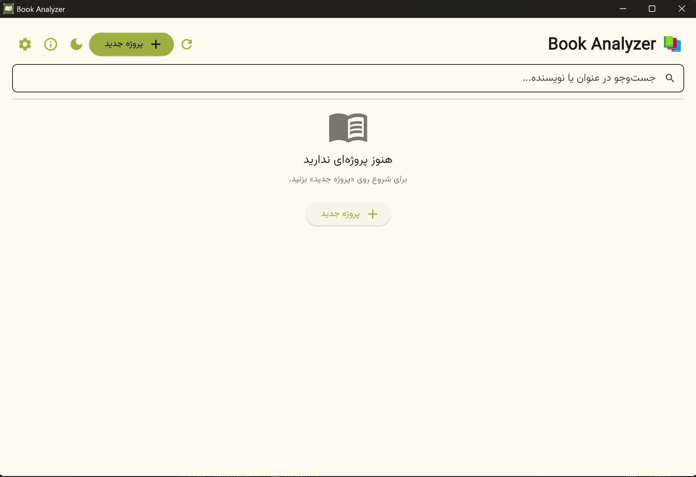

# Book Analyzer

تحلیل‌گر هوشمند کتاب برای مترجمان — انگلیسی → فارسی




<div dir="rtl" markdown="1">

## معرفی

**Book Analyzer** یک برنامه دسکتاپ تک‌کاربره برای مترجمان و ویراستاران حرفه‌ای است که با گرفتن عنوان، نویسنده، چند لینک و بخشی از متن یک کتاب، تحلیلی چهارمحوری از آن تولید می‌کند:

- 📖 **ژانر** — اصلی و زیرژانر
- 🎭 **لحن** — با نمونه‌های نقل‌قول واقعی
- ✍️ **سبک نویسنده** — جمله، راوی، واژگان، ویژگی‌ها
- 🌐 **نکات ترجمه** — چالش‌ها و راهبردهای انگلیسی → فارسی

و سه خروجی می‌دهد:

| خروجی | زبان | کاربرد |
|---|---|---|
| `analysis.json` | انگلیسی | import در سیستم‌های واژه‌نامه‌ساز و مترجم LLM |
| `report.md` | فارسی | ویرایش و اشتراک‌گذاری |
| `report.pdf` | فارسی | ارائه به ویراستار یا چاپ |

علاوه بر این، یک **پرامپت ترجمه آماده** بر اساس تحلیل تولید می‌شود.

---

## نصب

### نسخه نصبی (پیشنهادی)

از [Releases](https://github.com/mafeiznia/book-analyzer/releases) فایل `BookAnalyzer_Setup_x64_v1.0.0.exe` را دانلود و نصب کنید.

**پیش‌نیاز:** ویندوز ۱۰ نسخه ۱۸۰۹ یا بالاتر (x64).

### نسخه توسعه (Python)

```powershell
git clone https://github.com/mafeiznia/book-analyzer.git
cd book-analyzer
py -3.12 -m venv .venv
.\.venv\Scripts\Activate.ps1
pip install -r requirements.txt
Copy-Item .env.example .env
python app.py
```

---

## اولین اجرا

1. به **تنظیمات** (آیکن چرخ‌دنده) بروید.
2. یک Provider را انتخاب و کلید API آن را وارد کنید. پیشنهاد: **Groq** (رایگان، سریع).
3. روی «تست اتصال» بزنید.
4. روی «فعال‌سازی» بزنید.
5. یک **پروژه جدید** بسازید و فیلدها را پر کنید.
6. روی **«شروع تحلیل»** بزنید.

راهنمای کامل: [`docs/USER_GUIDE.md`](docs/USER_GUIDE.md)

---

## Providerهای پشتیبانی‌شده

| Provider | کلید رایگان | پایداری | سرعت |
|---|---|---|---|
| **Groq** | ✅ | ⭐⭐⭐⭐⭐ | بسیار سریع |
| OpenRouter | ✅ (محدود) | ⭐⭐ | متوسط |
| OpenAI | ❌ (پول‌دار) | ⭐⭐⭐⭐⭐ | متوسط |
| Google Gemini | ✅ | ⭐⭐⭐⭐ | متوسط |
| DeepSeek | ❌ | ⭐⭐⭐⭐ | متوسط |
| GLM (Zhipu) | ❌ | ⭐⭐⭐ | متوسط |

**توصیه:** برای شروع، **Groq** را انتخاب کنید (رایگان و پایدار).
راهنما: [console.groq.com/keys](https://console.groq.com/keys)

---

## ویژگی‌های کلیدی

- 🎨 **رابط کاربری فارسی RTL** با تم روشن/تاریک (قابل تغییر)
- 🔌 **Providerهای چندگانه** با امکان افزودن Provider سفارشی
- 🌐 **جست‌وجوی خودکار** با DuckDuckGo اگر لینک‌های کاربر کافی نباشند
- 📋 **لاگ زنده** با سطح ساده/فنی و دکمه کپی
- 📦 **نسخه‌بندی تحلیل‌ها** (v1, v2, ...) — نسخه‌های قبلی حفظ می‌شوند
- 🎯 **انتخاب مدل per-project**
- ⛔ **لغو تحلیل** در حین کار + نمایش زمان سپری‌شده
- 🔐 **مدیریت امن کلیدها** (پایگاه داده یا `.env`)

---

## ساختار پروژه

```
book-analyzer/
├── app.py                # نقطه ورود
├── ui/                   # رابط کاربری Flet
├── core/                 # منطق تحلیل
├── providers/            # لایه Providerها
├── storage/              # SQLite + migrations
├── exporters/            # خروجی JSON/MD/PDF
├── services/             # LogBus
├── assets/               # فونت و لوگو
├── docs/                 # مستندات
├── installer/            # Inno Setup
└── test/                 # تست‌های دستی
```

---

## مستندات

| سند | موضوع |
|---|---|
| [`docs/ARCHITECTURE.md`](docs/ARCHITECTURE.md) | معماری کامل |
| [`docs/USER_GUIDE.md`](docs/USER_GUIDE.md) | راهنمای کاربر |
| [`docs/DEVELOPER_GUIDE.md`](docs/DEVELOPER_GUIDE.md) | راه‌اندازی و توسعه |
| [`docs/ROADMAP.md`](docs/ROADMAP.md) | نقشه راه |
| [`docs/CHANGELOG.md`](docs/CHANGELOG.md) | تاریخچه تغییرات |
| [`docs/TESTING_GUIDE.md`](docs/TESTING_GUIDE.md) | تست‌ها |
| [`docs/TROUBLESHOOTING.md`](docs/TROUBLESHOOTING.md) | عیب‌یابی |
| [`docs/HANDOFF.md`](docs/HANDOFF.md) | تحویل پروژه |
| [`docs/HANDOFF_PROVIDERS.md`](docs/HANDOFF_PROVIDERS.md) | چارچوب Provider (قابل استفاده مجدد) |
| [`docs/HANDOFF_ABOUT_DIALOG.md`](docs/HANDOFF_ABOUT_DIALOG.md) | چارچوب About (قابل استفاده مجدد) |
| [`docs/HANDOFF_INSTALLER.md`](docs/HANDOFF_INSTALLER.md) | چارچوب Installer (قابل استفاده مجدد) |

---

## توسعه

```powershell
# build خودکار + پاکسازی نسخه توزیعی
.\build_release.ps1

# ساخت Installer
cd installer
iscc BookAnalyzer_x64.iss
```

راهنمای کامل: [`docs/DEVELOPER_GUIDE.md`](docs/DEVELOPER_GUIDE.md)

---

## محدودیت‌های شناخته‌شده

- **اسکرول صفحه با چرخ ماوس «تکه‌تکه» است** — محدودیت Flet 0.24 روی ویندوز دسکتاپ. با اسکرول‌بار یا کشیدن آن کار می‌کند. در نسخه‌های بعدی Flet (1.0+) ممکن است رفع شود.
- **مدل‌های رایگان OpenRouter ناپایدار هستند** — ممکن است مدل بدون اطلاع قبلی از دسترس خارج شود. راه‌حل: استفاده از Groq (پایدار و رایگان) یا شارژ OpenRouter.
- **خروجی ARM64** برای installer فعلاً موجود نیست — فقط x64.

---

## مجوز

[MIT License](LICENSE) — © 2026 Mahmoud Aharpour Feiznia

---

## ارتباط

- 🌐 وب‌سایت: [yadoto.ir](https://yadoto.ir)
- 📧 ایمیل: ma.feiznia@gmail.com
- 💼 LinkedIn: [Mahmoud Aharpour Feiznia](https://www.linkedin.com/in/mahmoud-aharpour-feiznia)

</div>